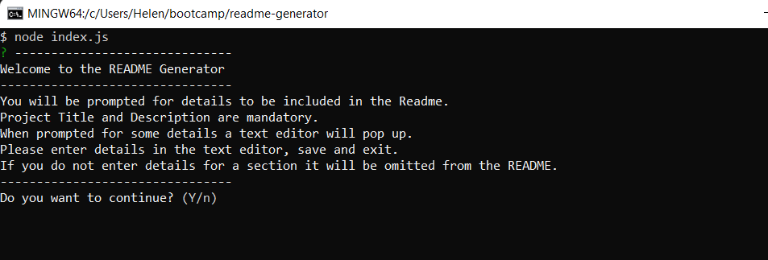
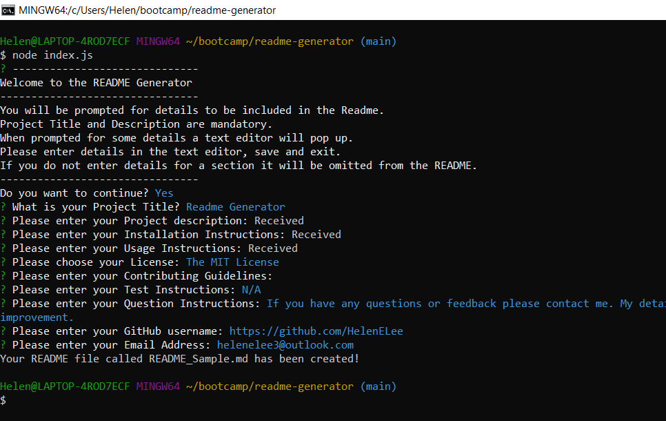

  # [](https://opensource.org/licenses/MIT)

  # Readme Generator

  ## Table of Contents
 - [Description](#description)
 - [User Story](#user-story)
 - [Acceptance Criteria](#acceptance-criteria)
 - [Installation](#installation)
 - [Usage](#usage)
 - [License](#license)
 - [Test Instructions](#test-instructions)
 - [Credits](#credits)
 - [Questions](#questions)
  
  ## Description
  This is a command line application which creates a professional Readme File for users. The user is prompted for information through a series of question prompts. The information supplied is gathered and used to create the readme. The README file includes a Table of Contents, Title and Description sections. Other optional sections are installation instructions, usage information, contribution guidelines, test instructions and contact details. Sections are only created where the information has been provided.

  The application is developed using the following technologies:
  - javascript
  - node.js
  - inquirer

  The main challenges in developing this application were familiarisation with Node and Inquirer.
  
  ## User Story
  AS A developer
  I WANT a README generator
  SO THAT I can quickly create a professional README for a new project

   ## Acceptance Criteria
  GIVEN a command-line application that accepts user input
  WHEN I am prompted for information about my application repository
  THEN a high-quality, professional README.md is generated with the title of my project and sections entitled Description, Table of Contents, Installation, Usage, License, Contributing, Tests, and Questions
  WHEN I enter my project title
  THEN this is displayed as the title of the README
  WHEN I enter a description, installation instructions, usage information, contribution guidelines, and test instructions
  THEN this information is added to the sections of the README entitled Description, Installation, Usage, Contributing, and Tests
  WHEN I choose a license for my application from a list of options
  THEN a badge for that license is added near the top of the README and a notice is added to the section of the README entitled License that explains which license the application is covered under
  WHEN I enter my GitHub username
  THEN this is added to the section of the README entitled Questions, with a link to my GitHub profile
  WHEN I enter my email address
  THEN this is added to the section of the README entitled Questions, with instructions on how to reach me with additional questions
  WHEN I click on the links in the Table of Contents
  THEN I am taken to the corresponding section of the README

  ## Installation
  Ensure node is installed. Test by running 
  ```
  node -v
  ```
  Install Inquirer : 
  ```
  npm i inquirer@8.2.4
  ```

  ## Usage
  To run this application enter:
```
node index.js
```
The user is initially provided with some information on how the application works and asked if they want to continue. If they choose "Yes" to continue, they will be brought through all the other questions. If they choose "No" to continue the application will exit.



Some questions require more details and therefore an editor will automatically open and allow the user enter several paragraphs of text. The user can include their own MarkDown code in these response, including links to images etc. The project Title and Description are mandatory and if the user omits to answer them they will be prompted repeatedly till they answer them. The License section provides a list of Licenses. To choose one the user can use the up and down arrow on the keyboard and click enter to select one. Once all the questions have been answered the README file will be generated. It will be saved into the same directory the application is in and is called README_Sample.md.
  
  

  Below is a link to a video recording of how the application works.
  
  [Video](https://drive.google.com/file/d/1tWqCY9O0zQmO10rGFo6YknleBkY56xJw/view)

  ## License
  This project is covered by the "The MIT License" license.
  For more details click on the link below:
  [License](https://opensource.org/licenses/MIT)
  
  
  ## Test Instructions
  N/A

  ## Credits
  I would like to thank the instructors at UWA Bootcamp. 
  
  ## Questions
 If you have any questions or feedback please contact me. My details are below. As this is a learning challenge for me I would appreciate any feedback, or ideas for improvement.

 Github : https://github.com/HelenELee 
 Email : helenelee3@outlook.com
  