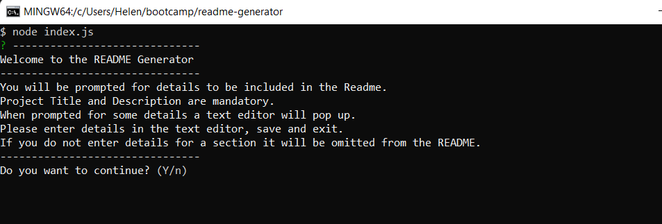
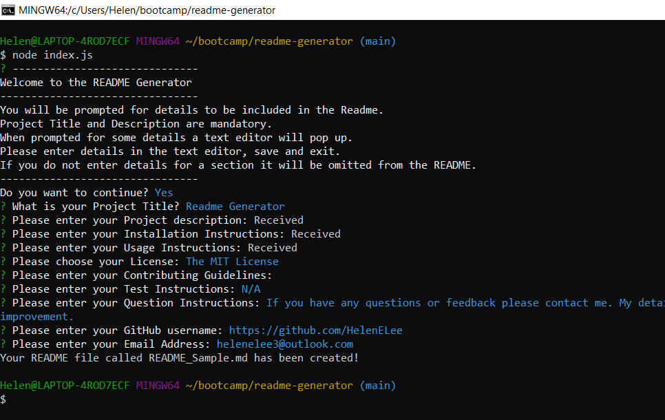

  # [](https://opensource.org/licenses/MIT)

  # Readme Generator

  ## Table of Contents
 - [Description](#description)
 - [Installation](#installation)
 - [Usage](#usage)
 - [License](#license)
 - [Test Instructions](#test-instructions)
 - [Questions](#questions)
  
    ## Description
  This is a command line application which creates a professional Readme File for users. The user is prompted for information through a series of question prompts. The information supplied is gathered and used to create the readme. The README file includes a Table of Contents, Title and Description sections. Other optional sections are installation instructions, usage information, contribution guidelines, test instructions and contact details. Sections are only created where the information has been provided.
  
  ## Installation
  Install node, then install Inquirer
  
  ## Usage
  To run this application enter:
```
node index.js
```
You will be given some information on how the application works and asked if you wanto to continue. If you choose yes to continue, you will be brought through all the other questions. If you choose No to continue the application will exit.



Some questions require more details and therefore an editor will automatically open and allow you enter several paragraphs of text. You can include  your own MarkDown code in these including links to images etc. The project Title and Description are mandatory and if you omit to answer them you will be prompted repeatedly till you answer them. The License section provides a list of Licenses. To choose one use the up and down arrow on your keyboard and click enter to select one. Once all the questions have been answered the README file will be generated for you. It will be saved into the same directory you ran the application in.
  
  

  ## License
  This project is covered by the "The MIT License" license.
  For more details click on the link below:
  [License](https://opensource.org/licenses/MIT)
  
  
  ## Test Instructions
  N/A
  
  ## Questions
 If you have any questions or feedback please contact me. My details are below.
 Github : https://github.com/HelenELee Email : helenelee3@outlook.com
  